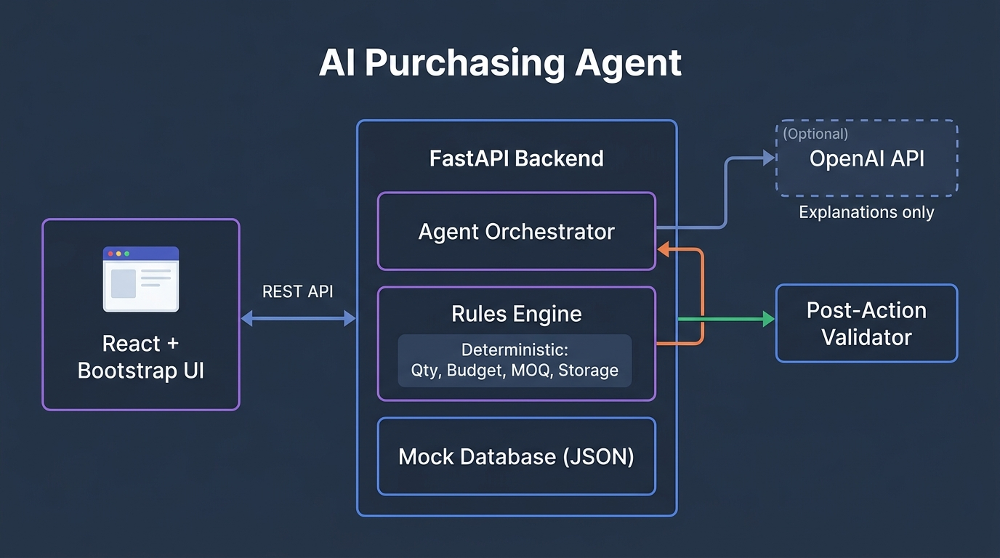

# AI Purchasing Agent — Purchase Recommendation Review

An AI-powered purchasing agent that evaluates, executes, and validates purchase recommendations using deterministic business rules with optional LLM-powered explanations.

## Problem

Purchasing systems generate buy recommendations, but these recommendations shouldn't be blindly executed. This agent reviews recommendations by gathering context (inventory, demand, open POs, supplier constraints, budget, storage) and decides whether to **ACCEPT**, **MODIFY**, **REJECT**, or **INVESTIGATE** each recommendation.

**Key principle:** The LLM does NOT perform critical calculations. All quantity, budget, MOQ, and storage validations use deterministic Python rules that are testable and auditable.

## Architecture



| Component | Purpose |
|-----------|---------|
| **React + Bootstrap UI** | Product selection, qty input, decision display, approval workflow |
| **FastAPI Backend** | REST API layer |
| **Agent Orchestrator** | Gathers context, coordinates rules + LLM, creates POs |
| **Rules Engine** | Deterministic calculations: need, MOQ, budget, storage constraints |
| **Mock Database** | JSON-based data store for products, inventory, suppliers, POs |
| **Post-Action Validator** | Feedback loop — validates POs after creation |
| **Gemini API** (optional) | Human-readable explanations (falls back to templates) |

## Approach

### Why Separate Rules from LLM?

1. **LLMs are unreliable at math.** A miscalculation on a $50K budget is unacceptable.
2. The rules engine is **deterministic, testable, and auditable**.
3. The LLM adds value only in **explanation generation** — making decisions human-readable.
4. This mirrors real purchasing systems: ERP does the math, humans interpret results.

### Quantity Calculation

```
required_qty = demand_30_days + safety_stock - available_inventory - incoming_from_open_POs
```

### Constraint Pipeline

Applied sequentially — each can limit the previous:

1. **MOQ Check** — raise quantity to meet supplier minimum order
2. **Budget Check** — cap at max affordable units
3. **Storage Check** — cap at max storable units
4. **Post-MOQ Recheck** — if constraints pushed below MOQ → INVESTIGATE

## Agent Workflow

```
User enters recommendation (SKU + quantity)
    │
    ▼
┌─ GATHER CONTEXT ──────────────────────────┐
│  • Current inventory (on-hand, reserved)   │
│  • Demand forecast (30/60 day, safety)     │
│  • Open purchase orders (incoming qty)     │
│  • Supplier (MOQ, lead time, reliability)  │
│  • Budget (remaining monthly)              │
│  • Storage (available m³)                  │
└────────────────────────────────────────────┘
    │
    ▼
┌─ EVALUATE (Rules Engine) ─────────────────┐
│  1. Calculate actual need                  │
│  2. Apply MOQ constraint                   │
│  3. Apply budget constraint                │
│  4. Apply storage constraint               │
│  5. Determine action: ACCEPT/MODIFY/       │
│     REJECT/INVESTIGATE                     │
│  6. Assess risk level                      │
└────────────────────────────────────────────┘
    │
    ▼
┌─ RISK CHECK ──────────────────────────────┐
│  HIGH risk? → Require human approval       │
│  (cost >50% budget, low supplier           │
│   reliability, qty >2x need)               │
└────────────────────────────────────────────┘
    │
    ▼
┌─ EXECUTE ─────────────────────────────────┐
│  Create Purchase Order (if ACCEPT/MODIFY)  │
└────────────────────────────────────────────┘
    │
    ▼
┌─ VALIDATE (Feedback Loop) ────────────────┐
│  Post-action checks:                       │
│  • qty ≥ supplier MOQ                      │
│  • total cost ≤ budget                     │
│  • volume ≤ storage capacity               │
│  • qty is reasonable (≤3x need)            │
│  • cost matches expected                   │
│                                            │
│  PASS → Confirm PO                         │
│  FAIL → Flag for review, don't confirm     │
└────────────────────────────────────────────┘
```

## APIs / Tools

| Endpoint | Method | Description |
|----------|--------|-------------|
| `/api/products` | GET | List all products |
| `/api/products/{sku}` | GET | Product details + context data |
| `/api/evaluate` | POST | Evaluate a purchase recommendation |
| `/api/approve` | POST | Human approval for high-risk purchases |
| `/api/purchase-orders` | GET | List all purchase orders |
| `/api/reset` | POST | Reset database to initial state |
| `/api/health` | GET | Health check |

### Example: Evaluate

```bash
curl -X POST http://localhost:8000/api/evaluate \
  -H "Content-Type: application/json" \
  -d '{"sku": "SKU-001", "recommended_qty": 800}'
```

## Validation & Feedback Loop

The agent doesn't just create a PO and move on. After creating a PO, `validate_purchase_order()` runs 5 checks:

1. **MOQ Check** — PO qty ≥ supplier minimum
2. **Budget Check** — PO cost ≤ remaining budget
3. **Storage Check** — PO volume ≤ available storage
4. **Reasonableness** — PO qty ≤ 3× calculated need
5. **Cost Accuracy** — PO total matches qty × unit_cost

**If validation fails:** The PO status becomes `validation_failed` and requires manual review. This catches edge cases where constraints interact unexpectedly.

## Test Results

```
19 passed in 0.07s

tests/test_agent.py::TestAccept::test_accept_when_recommendation_matches_need     PASSED
tests/test_agent.py::TestAccept::test_accept_agent_workflow                        PASSED
tests/test_agent.py::TestModify::test_modify_when_too_many_recommended             PASSED
tests/test_agent.py::TestModify::test_modify_agent_creates_adjusted_po             PASSED
tests/test_agent.py::TestReject::test_reject_when_supply_covers_demand             PASSED
tests/test_agent.py::TestReject::test_reject_agent_workflow                        PASSED
tests/test_agent.py::TestConstraints::test_budget_constraint_limits_quantity        PASSED
tests/test_agent.py::TestConstraints::test_storage_constraint_limits_quantity       PASSED
tests/test_agent.py::TestConstraints::test_moq_applied_when_need_below_minimum     PASSED
tests/test_agent.py::TestValidationFailure::test_po_validation_fails_on_budget     PASSED
tests/test_agent.py::TestValidationFailure::test_validation_failure_in_workflow     PASSED
tests/test_agent.py::TestValidationFailure::test_po_catches_moq_violation          PASSED
tests/test_agent.py::TestHumanApproval::test_high_risk_requires_approval           PASSED
tests/test_agent.py::TestHumanApproval::test_low_risk_auto_approves                PASSED
tests/test_agent.py::TestRulesEngineUnits::test_calculate_required_quantity         PASSED
tests/test_agent.py::TestRulesEngineUnits::test_moq_raises_low_qty                 PASSED
tests/test_agent.py::TestRulesEngineUnits::test_moq_no_change_when_above           PASSED
tests/test_agent.py::TestRulesEngineUnits::test_budget_limits_qty                  PASSED
tests/test_agent.py::TestRulesEngineUnits::test_storage_limits_qty                 PASSED
```

### Test Scenarios

| Test | Input | Expected | Validates |
|------|-------|----------|-----------|
| ACCEPT | SKU-001, qty=600 | Accept at 600, PO created, validation passes | Happy path |
| MODIFY | SKU-001, qty=800 | Modify to 600 (actual need), PO created | Agent doesn't blindly accept |
| REJECT | Supply > demand | Reject, no PO created | Agent prevents unnecessary purchases |
| Budget constraint | Low budget | Qty reduced to max affordable | Budget enforcement |
| Storage constraint | Limited space | Qty reduced to max storable | Storage enforcement |
| MOQ enforcement | Need < MOQ | Qty raised to meet MOQ | Supplier requirements |
| Validation failure | PO exceeds budget | Validation fails, PO flagged | Feedback loop works |
| Human approval | High-risk purchase | Requires approval before PO | Safety gate |

## Setup & Run Instructions

### Prerequisites

- Python 3.11+
- Node.js (optional, frontend uses CDN)
- Docker (optional)

### Option 1: Local Development

```bash
# Clone and enter project
git clone <repo-url> && cd ai-purchasing-agent

# Install Python dependencies
pip install -r requirements.txt

# Copy environment file (optional for LLM explanations)
cp .env.example .env

# Run tests
pytest tests/ -v

# Start backend (port 8000)
uvicorn backend.main:app --host 0.0.0.0 --port 8000

# Start frontend (port 3000) — in another terminal
python -m http.server 3000 --directory frontend

# Open http://localhost:3000
```

### Option 2: Docker Compose

```bash
# Build and run
docker-compose up --build

# Frontend: http://localhost:3000
# Backend API: http://localhost:8000
# API docs: http://localhost:8000/docs
```

### Environment Variables

| Variable | Required | Description |
|----------|----------|-------------|
| `GEMINI_API_KEY` | No | Enables LLM-powered explanations (free at [aistudio.google.com](https://aistudio.google.com/apikey)). Falls back to templates. |

## Project Structure

```
├── backend/
│   ├── __init__.py
│   ├── main.py              # FastAPI application
│   ├── agent.py              # Agent orchestrator
│   ├── database.py           # Mock database (JSON)
│   └── rules_engine.py       # Deterministic business rules
├── frontend/
│   ├── index.html            # HTML shell
│   ├── app.jsx               # React application
│   └── styles.css            # Dark theme stylesheet
├── tests/
│   └── test_agent.py         # 19 test cases
├── data/
│   └── mock_data.json        # Realistic mock data
├── docs/
│   ├── architecture.png      # Architecture diagram
│   └── INTERVIEW_GUIDE.md    # Interview preparation
├── docker-compose.yml
├── Dockerfile.backend
├── Dockerfile.frontend
├── nginx.conf
├── requirements.txt
├── .env.example
├── .gitignore
└── README.md
```

## Limitations

1. **In-memory database** — Data resets on server restart (acceptable for demo)
2. **Single supplier per product** — Real systems would support multiple suppliers
3. **No authentication** — Out of scope for this assignment
4. **No persistent audit trail** — Decisions are logged in-memory only
5. **Static demand forecast** — Real systems would use dynamic forecasting
6. **LLM explanations are optional** — System is fully functional without Gemini API key
7. **Frontend uses CDN** — React/Bootstrap loaded from CDN (no build step needed)

## What Would Change for Production

- PostgreSQL with SQLAlchemy for persistence
- JWT authentication + role-based access control
- Message queue (RabbitMQ/Kafka) for async PO processing
- Multi-supplier routing with cost optimization
- Real-time demand signal integration
- Audit trail with decision versioning
- Monitoring and alerting (Prometheus/Grafana)
